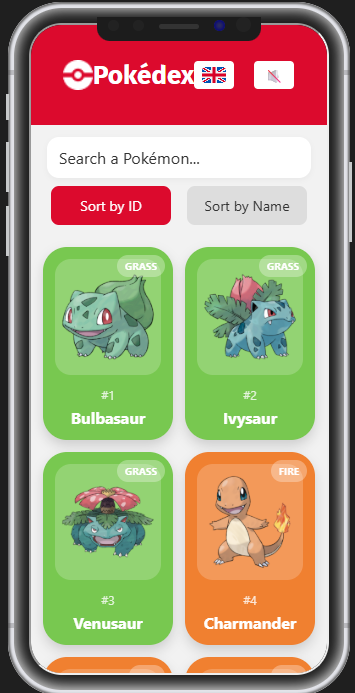
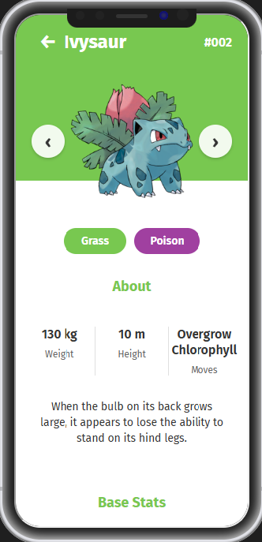

# 📱 Pokédex React Native

<div align="center">


**Une application Pokédex développée avec React Native et Expo**

</div>

---

## ✨ Fonctionnalités

### 🔍 **Navigation et Recherche**
- ✅ **Liste infinie** : Parcourez tous les Pokémon avec pagination automatique
- ✅ **Recherche intelligente** : Trouvez un Pokémon par nom ou ID
- ✅ **Tri avancé** : Organisez par nom ou numéro
- ✅ **Navigation fluide** : Swipe entre les Pokémon dans les détails

### 🎨 **Interface Utilisateur**
- ✅ **Design adaptatif** : Interface avec animations fluides
- ✅ **Thème par type** : Couleurs dynamiques selon le type de Pokémon
- ✅ **Images haute qualité** : Artwork officiel de chaque Pokémon

### 🌐 **Localisation**
- ✅ **Support multilingue** : Français et Anglais
- ✅ **Changement de langue** : Basculez facilement via le bouton drapeau
- ✅ **Traductions complètes** : Types, capacités, statistiques

### 🔊 **Audio et Interactivité**
- ✅ **Cris des Pokémon** : Écoutez le cri unique de chaque Pokémon
- ✅ **Contrôle audio** : Bouton mute/unmute pour désactiver les sons

### 📊 **Informations Détaillées**
- ✅ **Statistiques complètes** : HP, Attaque, Défense, etc.
- ✅ **Types et faiblesses** : Visualisation claire des types
- ✅ **Capacités** : Liste des capacités avec traductions
- ✅ **Données physiques** : Taille, poids, description

---

## 🚀 Installation et Démarrage

### Prérequis
- Node.js (version 18 ou supérieure)
- npm ou yarn
- Expo CLI (optionnel mais recommandé)

### Installation

```bash
# 1. Cloner le projet
git clone https://github.com/ProLeblancQ/Podedx-React-Native.git
cd Podedx-React-Native

# 2. Installer les dépendances
npm install

# 3. Lancer l'application
npx expo start
```

### Lancement sur différentes plateformes

```bash
# Android
npx expo start --android

# iOS
npx expo start --ios

# Web
npx expo start --web
```

---

## 🛠️ Technologies Utilisées

### **Frontend**
- **React Native** - Framework mobile cross-platform
- **Expo** - Plateforme de développement
- **TypeScript** - Typage statique

### **Navigation & État**
- **Expo Router** - Navigation basée sur les fichiers
- **React Query** - Gestion du cache et des requêtes API
- **Context API** - Gestion de l'état global

### **UI/UX**
- **React Native Reanimated** - Animations performantes
- **Expo AV** - Gestion audio
- **Fira Sans** - Police personnalisée

### **API & Données**
- **PokéAPI** - Source de données officielle
- **Expo Image** - Optimisation des images

---

## 📱 Captures d'Écran

### Interface Principale


*Liste des Pokémon avec recherche et tri*

### Détails d'un Pokémon  


*Écran de détails avec statistiques et audio*

---

## 📊 Architecture du Projet

```
src/
├── components/          # Composants réutilisables
│   ├── AudioToggle.tsx     # Bouton mute/unmute
│   ├── LanguageToggle.tsx  # Sélecteur de langue
│   ├── PokemonCard.tsx     # Carte Pokémon
│   ├── SearchBar.tsx       # Barre de recherche
│   └── SortButton.tsx      # Bouton de tri
├── contexts/           # Contextes React
│   ├── AudioContext.tsx    # Gestion audio
│   └── LanguageContext.tsx # Localisation
├── pages/              # Écrans principales
│   ├── PokemonListScreen.tsx    # Liste des Pokémon
│   └── PokemonDetailScreen.tsx  # Détails d'un Pokémon
├── service/           # Services et API
│   ├── pokeapi.tsx         # Client API
│   └── usePokemonSearch.tsx # Hook de recherche
└── utils/             # Utilitaires
    └── typeColor.tsx       # Couleurs par type
```


## 📄 Licence

Ce projet est sous licence MIT. Voir le fichier [LICENSE](LICENSE) pour plus de détails.

---

## 🙏 Remerciements

- **[PokéAPI](https://pokeapi.co/)** - Pour les données Pokémon gratuites
- **[Nintendo/Game Freak](https://www.pokemon.com/)** - Pour l'univers Pokémon
- **[Expo](https://expo.dev/)** - Pour la plateforme de développement
- **Communauté React Native** - Pour le support et les ressources

---

<div align="center">

**Attrapez-les tous ! 🎯**


</div>